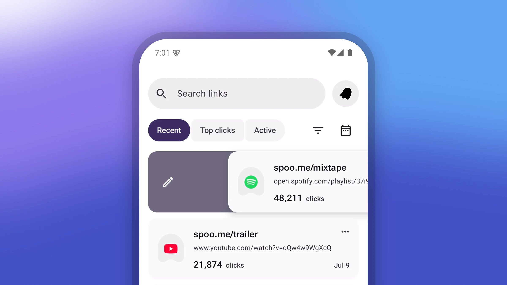
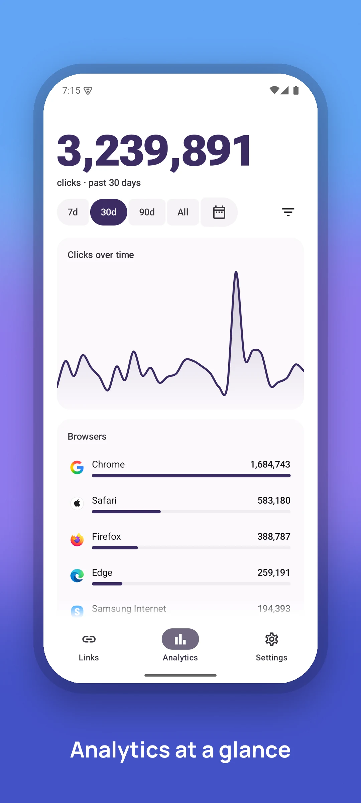
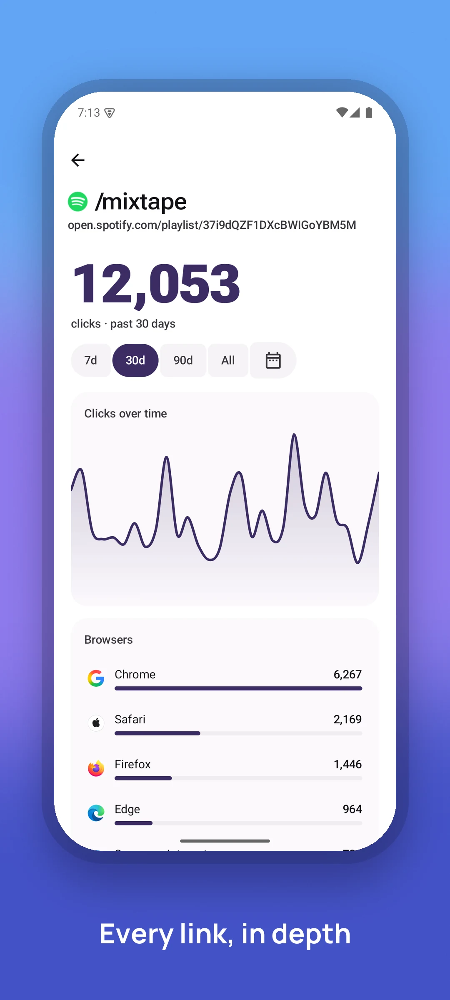
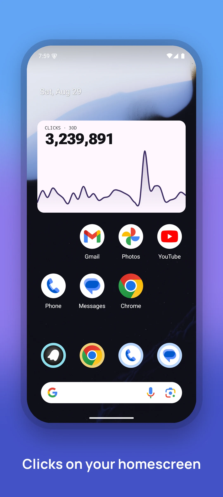
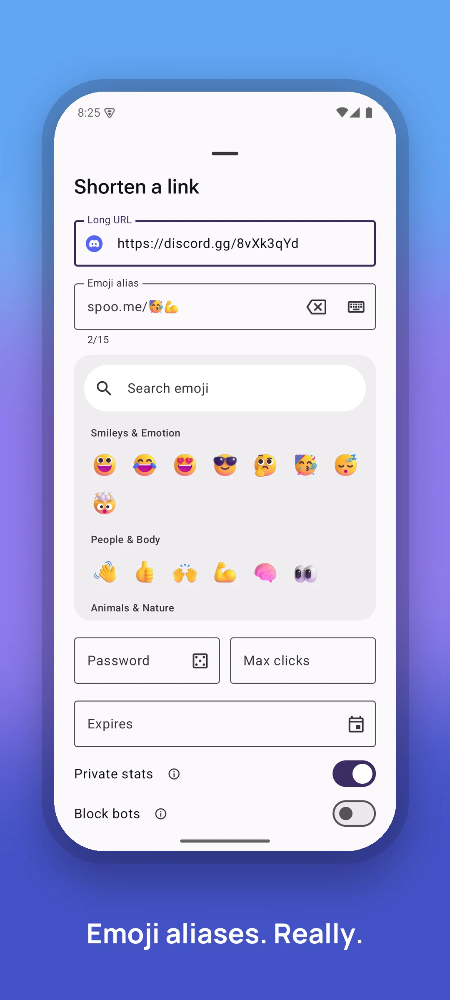
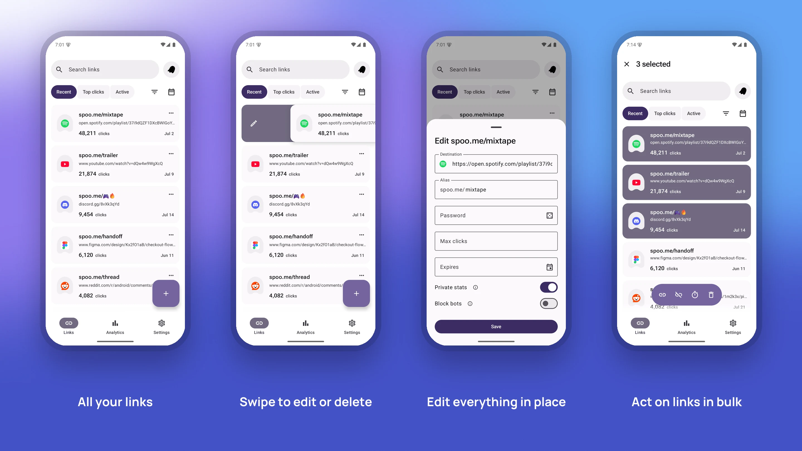
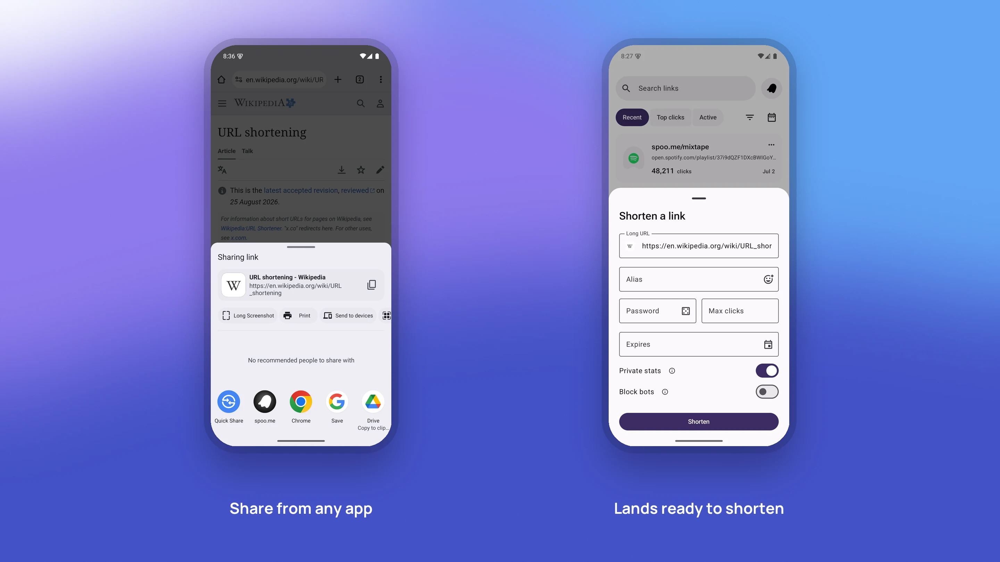
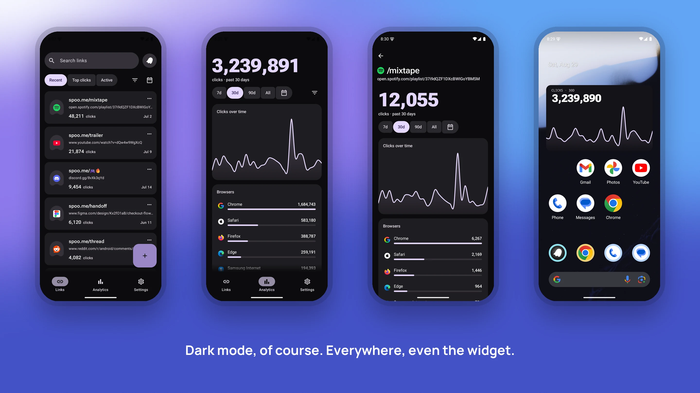

<div align="center">


# spoo.me for Android

### Shorten, manage, and analyze your spoo.me links from your pocket 🚀

Built end to end in [Material 3 Expressive](https://m3.material.io/blog/building-with-m3-expressive), springs and all.

<a href="#-download"><kbd>⬇️ Download</kbd></a>&nbsp;
<a href="#-features"><kbd>🔥 Features</kbd></a>&nbsp;
<a href="#-screenshots"><kbd>📸 Screenshots</kbd></a>&nbsp;
<a href="#-widgets"><kbd>📊 Widgets</kbd></a>&nbsp;
<a href="#%EF%B8%8F-development"><kbd>🛠️ Development</kbd></a>&nbsp;
<a href="#-contributing"><kbd>🤝 Contributing</kbd></a>

[](https://github.com/spoo-me/spoo-android/releases/latest)
[](https://github.com/spoo-me/spoo-android/releases)
[](https://github.com/spoo-me/spoo-android/actions)
[](https://kotlinlang.org)
[](https://spoo.me/discord)
[](LICENSE)



</div>

# ⬇️ Download

<div align="center">

[](https://github.com/spoo-me/spoo-android/releases/latest)
&nbsp;
[](https://apps.obtainium.imranr.dev/redirect.html?r=obtainium://add/https://github.com/spoo-me/spoo-android)

or just open **[spoo.me/android](https://spoo.me/android)** on your phone. Yes, the download link is a spoo link.

</div>

1. Tap Download. If Chrome warns the file might be harmful, choose **Download anyway**. That warning is standard for apps installed from outside the Play Store.
2. Open the downloaded file and allow installing from your browser when asked.
3. For automatic updates, use the Obtainium badge above instead.

# 🔥 Features

- `Share to Shorten` - Send any link from any app's share sheet and it lands in the create sheet, ready to go ⚡
- `Quick Settings Tile` - Shorten whatever is on your clipboard without opening the app 📋
- `Emoji Aliases` - Pick from the server's emoji set with a built-in picker, rendered in Fluent 3D instead of your keyboard's glyphs 🎨
- `Link Management` - Passwords, click limits, expiry with a real date and time picker, private stats, and bot blocking, all editable after the fact 🔧
- `Analytics` - Clicks over time, plus breakdowns by country, browser, OS, and referrer, filterable and scoped per link 📈
- `Home-screen Widgets` - Six chart styles, configured per instance, cached so they render stale data instead of spinners 📊
- `Styled QR Codes` - Circle-module QR with the spoo mark in the middle, shareable as an image or saved to your gallery 🔳
- `Material 3 Expressive` - Motion is springs, not tweens. Dynamic color from your wallpaper, or a seed color of your choosing, across the app and its widgets 🎭
- `Dark Mode` - Of course. Everywhere, even the widgets 🌙

# 📸 Screenshots

<div align="center">






<br><br>



<br><br>



<br><br>



</div>

# 📊 Widgets

Three shells show up in the widget picker, and each one opens a configuration screen where the real choice happens: chart style, metric, time range, and whether the widget tracks all your links or a single one. Breakdown charts also take dimension filters, the same vocabulary the Analytics tab uses.

| Style | Shows |
| --- | --- |
| `Wave` | Clicks over time as a filled curve, with the total on top |
| `Bars` | Clicks over time as bars, peak accented |
| `Number` | The total alone, in Roboto Flex, Serif, or Mono |
| `Treemap` | Top values in a dimension, sized by share |
| `Bubbles` | The same breakdown as packed circles |
| `Map` | Clicks by country on a world map |

> [!TIP]
> Widgets cache their last fetch per instance, so they show the numbers you saw last rather than a spinner while they refresh. Long-press to reconfigure one at any time.

# 🛠️ Development

Kotlin and Jetpack Compose, with Material 3 Expressive. The API layer is the [official Kotlin SDK](https://central.sonatype.com/artifact/me.spoo/spoo), so nothing in this repo hand-rolls HTTP.

```bash
git clone https://github.com/spoo-me/spoo-android.git
cd spoo-android
./gradlew installDebug          # build and install the debug variant
./gradlew lintDebug             # Android Lint, warnings fail the build
./gradlew testDebugUnitTest     # unit tests
pre-commit run --all-files      # ktlint, autofix on
```

You need JDK 21 and an Android device or emulator running API 26 or newer. To use the app itself you need a [spoo.me](https://spoo.me) account; sign-in happens in your browser with PKCE, so there are no API keys to paste.

Every release ships a checksum next to the APK if you want to verify a download:

```bash
sha256sum -c spoo.apk.sha256
```

> [!NOTE]
> Debug builds point at a local backend. To run against production, change `SPOO_BASE_URL` in `app/build.gradle.kts` or install a release build.

Settings has a mock-data switch in debug builds. Turn it on to browse a generated set of links and stats with no backend at all, which is the fastest way to work on UI.

Releases are automatic: conventional commits on `main` decide the version,
and CI signs and publishes the APK. See [docs/releasing.md](docs/releasing.md).

> [!IMPORTANT]
> Widget code runs in a different process than the app and stays frozen while cached, so anything a widget renders has to come from its own Glance state rather than from values captured when it was created.

# 🤝 Contributing

Issues and pull requests are welcome. Open one at [issues](https://github.com/spoo-me/spoo-android/issues/new) or [pulls](https://github.com/spoo-me/spoo-android/pulls), or come talk it through on [Discord](https://spoo.me/discord) first if it's a big change.

For anything else, reach us at <kbd>[✉️ support@spoo.me](mailto:support@spoo.me)</kbd>.

---

<h6 align="center">

<br>
© spoo.me . 2026

All Rights Reserved</h6>

<p align="center">
 <a href="https://github.com/spoo-me/spoo-android/blob/main/LICENSE"></a>
</p>
